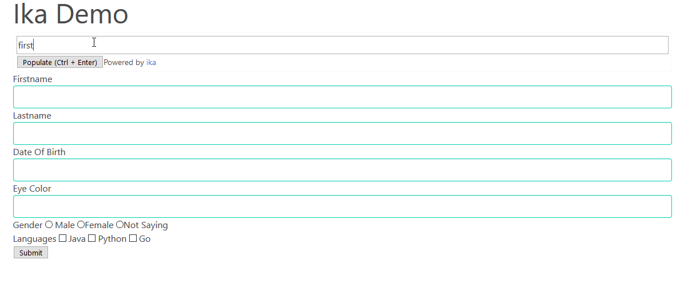

ika
===

`ika` is a small JavaScript library that makes filling forms faster and turns
regular users into power users!

It works by tagging fields on a form with a shorthand and enabling users to 
input the form fields via the shorthands in one field.

## DEMO



## USAGE

In order to use `ika` you currently need to do the following steps:

1. Add an element named `<div id="ika-apa"></div>` which will be replaced by the script
2. Tag your input fields with `data-ika` attributes.

For example:

```html
<input type="text" name="firstName" data-ika="firstName" />

<input type="text" name="lastName" data-ika="l" />

<input type="text" name="dateOfBirth" data-ika="dateOfBirth" />

<label for="Java">
    <input type="checkbox" name="languages[]" value="java" data-ika="java"> Java
</label>
```

3. Add the `ika.min.css` and `ika.min.js` files to your page (get them from the `build` directory)

## Styling

You can modify the styling of the element to fit your application's/form's aesthetics.
In order to do so. you mostly need to modify the following elements with CSS:

```css

/* The wrapper element that contains the text area and the button */
#nndi--ika-control {}

/* The element for the button */
#nndi--ika-btn {}

/* The element for the "text area" */
#nndi--ika-txt {}
```

---

Copyright (c) NNDI